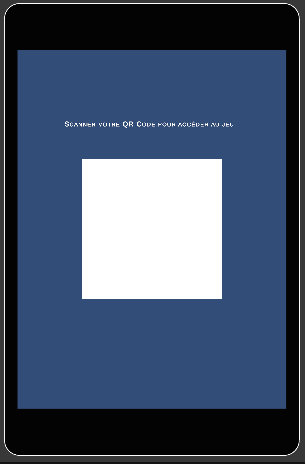
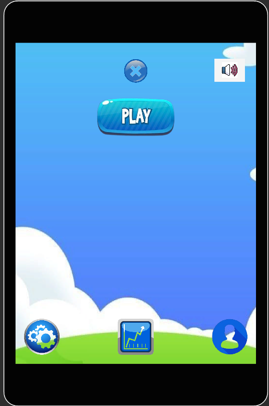
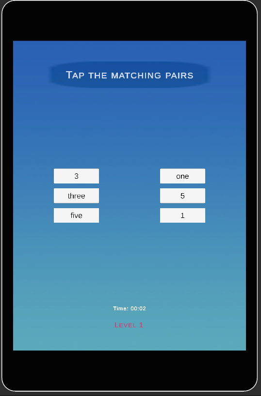
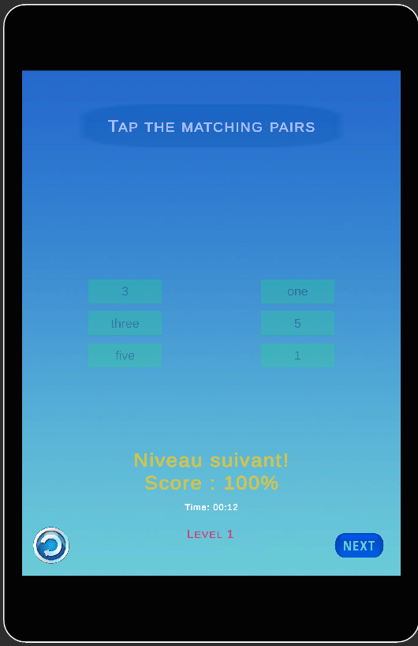

# 🎮 Tap Matching Pairs

Un jeu de mémoire et d'appariement développé avec Unity, où les joueurs doivent trouver et associer des paires un nombre et son correspondant en lettre en tapant sur les boutons.


##  Aperçu du jeu

Tap Matching Pairs est un jeu de mémoire classique où les joueurs doivent retrouver des paires entre un chiffre et une lettre. Le but est de trouver toutes les paires en un minimum de coups et dans le meilleur temps possible.

### Objectifs du jeu :
- Développer la mémoire et la concentration
- Améliorer les compétences cognitives
- Offrir une expérience de jeu relaxante et divertissante

##  Fonctionnalités

### Gameplay
- Mécaniques de tap/clic intuitives
- Système de score basé sur le temps et le nombre de coups
- Plusieurs niveaux de difficulté
- Animations fluides et retours visuels
- Système de vérification automatique des paires

### Interface utilisateur
-  Interface pour scanner le QRCode pour s'authentifier
-  Menu principal avec options
-  Affichage du score et du temps
-  Écran de victoire avec statistiques
-  Boutons de retour,de redémarrage et next

### Technique
-  Optimisé pour mobile et desktop
-  Sauvegarde automatique des progrès
-  Système de sons et effets sonores
-  Gestion des préférences utilisateur

## 📸 Captures d'écran

Interface pour scanner le QRCode

   

Menu principal  

  

Gameplay

   

Écran de victoire 

  

##  Installation

### Prérequis
- Unity 6
- Git installé sur votre système

### Étapes d'installation

1. **Cloner le repository**
   ```bash
   git clone https://github.com/MATH-mini-game/Tap_Matching_Pairs.git
   cd Tap_Matching_Pairs
   ```

2. **Ouvrir le projet dans Unity**
   - Lancez Unity Hub
   - Cliquez sur "Ouvrir un projet"
   - Sélectionnez le dossier du projet cloné

3. **Configurer les paramètres**
   - Vérifiez les paramètres de build pour votre plateforme cible
   - Configurez les paramètres de qualité si nécessaire

4. **Build et exécution**
   - Allez dans File > Build Settings
   - Sélectionnez votre plateforme cible
   - Cliquez sur "Build and Run"

## 🎮 Comment jouer

### Règles de base
1. **Démarrage** : les paires seront chargées
2. **Sélection** : Tapez sur deux cartes 
3. **Appariement** : Si les paires sont identiques, leurs couleurs seront vertes.
4. **Échec** : Si les paires sont différentes, leurs couleurs seront rouges.
5. **Victoire** : Trouvez toutes les paires pour gagner le niveau


## 🛠️ Technologies utilisées

### Moteur de jeu
- **Unity** 6
- **C#** : Langage de programmation principal

### Packages Unity utilisés
- Unity UI (uGUI) - Interface utilisateur
- Unity Audio - Système audio
- Unity Analytics - Analyse des données de jeu
- DOTween - Animations fluides

### Outils de développement
- **IDE** : Visual Studio 
- **Contrôle de version** : Git
- **Assets** 


## 🔧 Configuration du développement

### Paramètres Unity recommandés

#### Build Settings
- **Platform** : Windows/Android 
- **Architecture** : x86_64 (pour PC) / ARM64 (pour mobile)
- **Scripting Backend** : IL2CPP (recommandé pour mobile)

#### Player Settings
- **Company Name** : MATH-mini-game
- **Product Name** : Tap Matching Pairs
- **Version** : 1.0.0
- **Bundle Identifier** : com.tapmatchpairs

#### Quality Settings
- Configurez différents niveaux de qualité pour différentes plateformes
- Optimisez les paramètres pour les appareils mobiles


